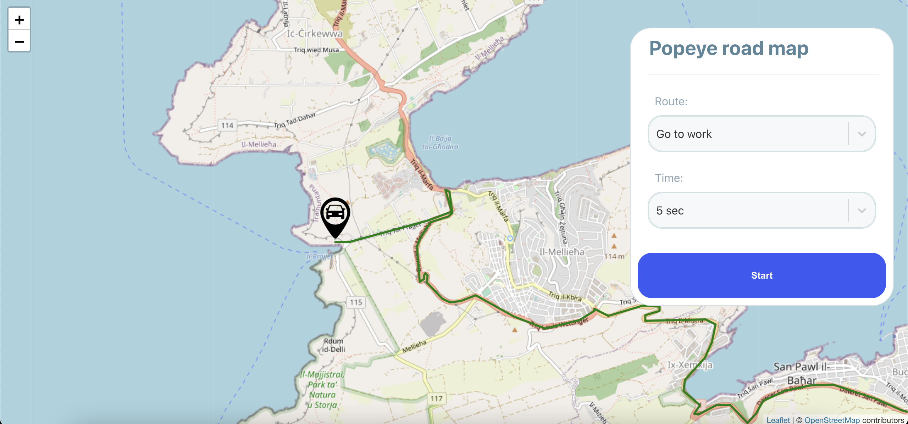

# Popeye Route
## Welcome to popeye balluta village



## Features

- Map Section with popeye real time movement.
- Select input to change popeye route.
- Select input to change popeye movement time.

## Tech

Techs used to build this project:

- [React JS]
- [Node JS]
- [TypeScript]
- [Mongo]
- [Express]
- [Socket.io]

## Installation

### Running with docker

```sh
git clone https://github.com/keelviinn/popeye.git
cd popeye
docker-compose build
docker-compose up
```

Now your client is available on `http://localhost:3000` and the server on `http://localhost:3333`

## Documentation

### Socket server events:

#### __listeners__:

__on "connection"__: 
Get user connection
***

__on "disconnect"__
Get user disconnection
***

__on "get-geolocation"__
This listener allows the client to get the Route GeoJson and the initial connection
```
Params: {
    routeLabel: string; 
}
```
***

__on "set-time"__
This listener allows the client to change the movement time
```
Params: {
    time: number; 
}
```
***

__on "start-navigation"__
This listener allows the client to track the real time popeye movement
```
Params: {
    time: number; 
    routeLabel: string;
}
```
***

#### __Emitters__:

__on "set-geolocation"__
This emitter send to client the GeoJson Object
```
Params: {
    type: string; 
    features: object;
}
```
***

__on "set-position"__
This emitter send to client the current position
```
Params: {
    [number, number]
}
```
